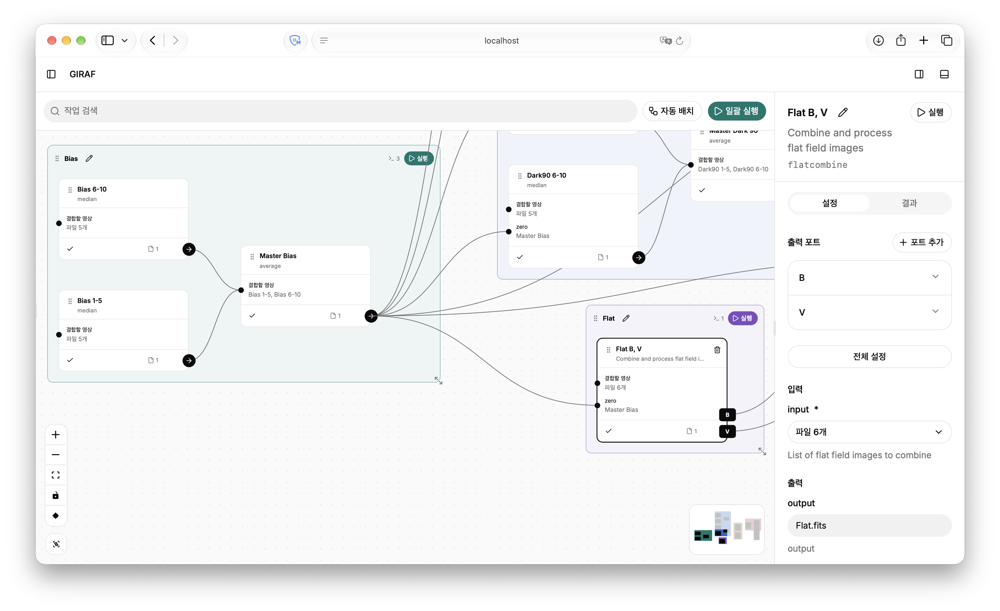

# GIRAF



GIRAF는 [IRAF](https://iraf-community.github.io)의 파이프라인을 시각화하고 관리하는 앱입니다. IRAF에서 수행하는 작업들을 드래그 앤 드롭으로 연결하며 파이프라인을 더 알기 쉽게 하는 것을 목표로 제작되었습니다.

## 주요 기능

- IRAF에서 수행하는 작업들을 GUI로 관리하고 편집할 수 있습니다.
- FITS 이미지를 열람할 수 있습니다.
- 원본 FITS를 건드리지 않고 사본으로 작업할 수 있습니다.

## 설치 및 실행

- [uv](https://docs.astral.sh/uv/getting-started/installation/)와 [Bun](https://bun.sh/docs/installation)이 필요합니다
-  IRAF 또는 PyRAF가 설치되어 있어야 합니다.

> [!WARNING]
> GIRAF는 아직 개발 중인 프로젝트입니다. 호환성, 최적화, 코드 퀄리티 등 많은 부분을 개선해 나가고 있으며, 아직 IRAF CL 또는 PyRAF와 완전히 동일한 작업을 수행함을 보장하기 어렵습니다.

### 1. GIRAF 다운로드

[저장소](https://github.com/ys-astro-js/giraf)에서 **Code → Download ZIP**으로 내려받아 압축을 풀고 터미널에서 해당 폴더로 이동해 주세요.

Git으로 내려받으려면 아래 명령을 실행합니다.

```sh
git clone https://github.com/ys-astro-js/giraf.git
cd giraf
```

이후 명령은 `README.md`와 `main.py`가 있는 GIRAF 폴더에서 실행합니다.

### 2. 설치

Python 3.12 이상이 없다면 먼저 설치합니다.

```sh
uv python install 3.12
```

GIRAF 폴더에서 다음 명령을 실행합니다.

```sh
uv sync --locked
cd web
bun install --frozen-lockfile
bun run build
cd ..
```

### 3. 실행

```sh
uv run main.py
```

브라우저에서 [http://127.0.0.1:8501/](http://127.0.0.1:8501/)에 접속합니다.

종료하려면 실행한 터미널에서 **Ctrl+C**를 누릅니다. 다음부터는 GIRAF 폴더에서 `uv run main.py`만 실행하면 됩니다.

## 사용 방법

1. 왼쪽 작업 목록에서 원하는 IRAF 작업을 추가한 뒤 워크플로우 화면에서 선택합니다. 이 작업 각각을 **노드**라 합니다.
2. 각 노드는 작업할 파일을 입력받거나, 작업한 파일을 출력할 수 있습니다. 파일을 입력받는 부분을 **입력 포트**, 출력하는 부분을 **출력 포트**라 합니다.
3. 한 노드의 출력 포트와 다른 노드의 입력 포트를 연결하면, 노드의 출력 결과를 다음 노드의 입력으로 연결할 수 있습니다. 예를 들어 `zerocombine` 노드의 출력 포트를 `darkcombine` 노드의 `zero` 입력 포트에 연결하면, master bias를 이용해 dark 이미지를 보정할 수 있습니다.
4. 여러 노드를 그룹으로 묶어 한 번에 실행하도록 설정할 수 있습니다.
5. 실행 기록과 결과는 GIRAF 폴더의 `runs/`에 저장됩니다.

## FAQ

### IRAF를 찾지 못한다고 나옵니다

IRAF가 설치되어 있는지 확인해 주세요. 일반적인 설치 경로는 자동으로 찾지만 다른 위치에 설치했다면 실행 전에 경로를 지정해야 합니다. 아래 경로를 실제 IRAF 설치 폴더로 바꿔 주세요.

```sh
export iraf="/path/to/iraf/"
uv run main.py
```

실행 엔진으로 **IRAF CL**을 선택했다면 터미널에서 `irafcl` 명령을 사용할 수 있어야 합니다.

### 브라우저에서 화면이 열리지 않습니다

`uv run main.py`를 실행한 터미널이 열려 있는지, 오류가 표시되지 않았는지 확인해 주세요. 처음 설치할 때 `bun run build`까지 완료했는지도 확인합니다. 접속 주소는 `http://127.0.0.1:8501/`입니다.

### 실행이 실패하거나 일부 영상이 처리되지 않습니다

실행 기록에서 해당 작업의 **로그**를 열어 오류 내용을 확인한 뒤 입력 파일, `ccdtype`, 보정 자료와 파라미터를 살펴보세요.

### 원본 파일이 바뀌나요?

실행 대상의 기본값은 **사본**입니다. **원본 파일**을 선택하면 원본이 변경될 수 있습니다.

### 모든 FITS 영상을 열 수 있나요?

내장 영상 뷰어는 FITS의 Primary HDU에 있는 2D 영상을 표시합니다.
